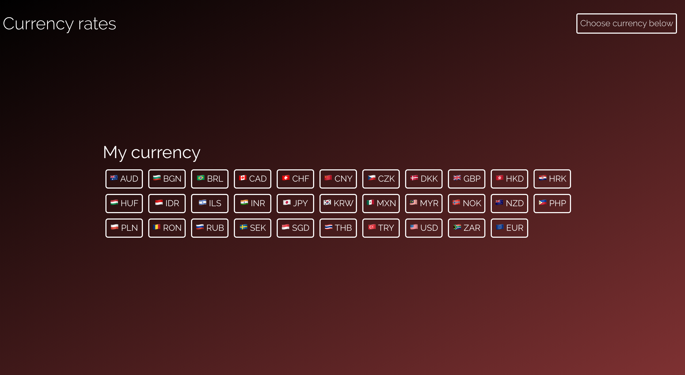
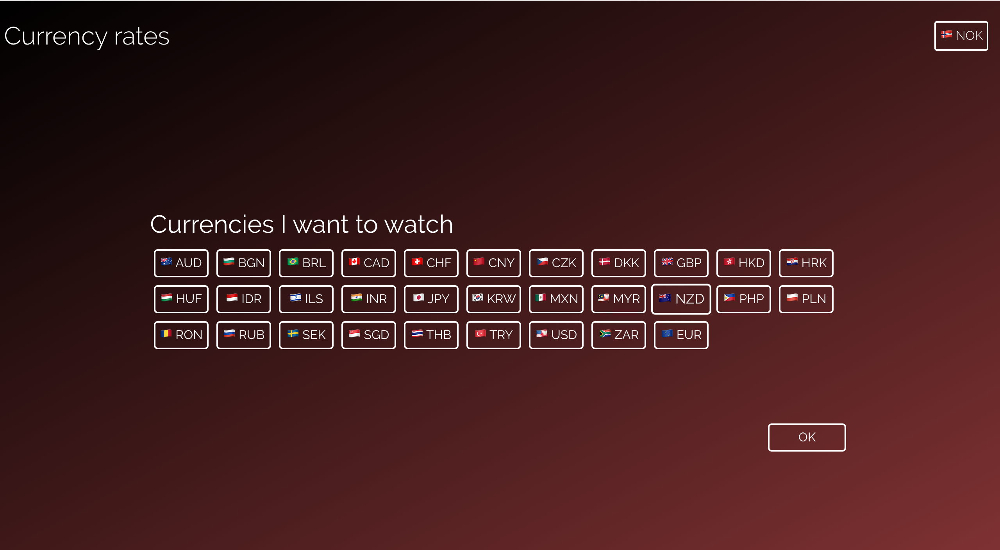
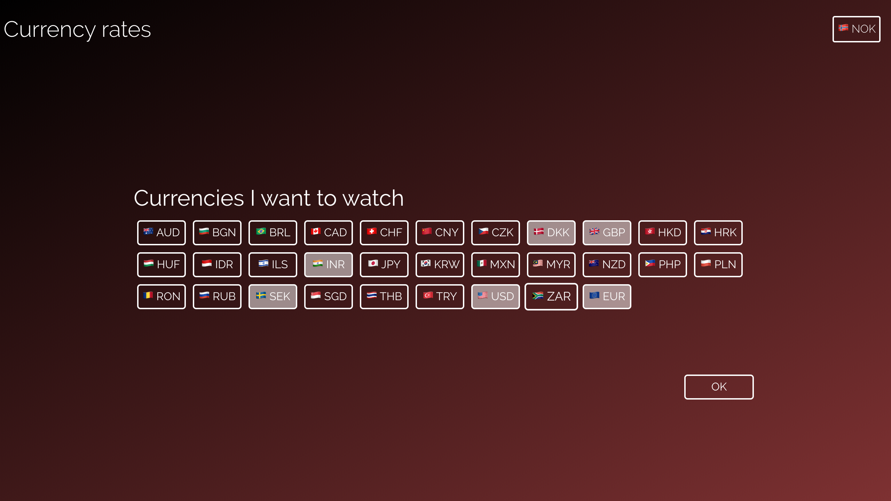
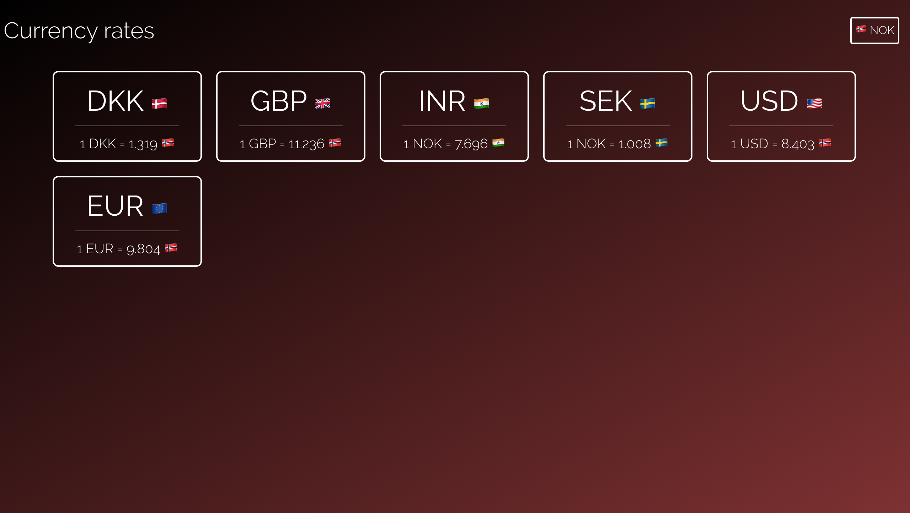

# Currencies!
A simple, and maybe hacky first React app. It uses the [Fixer API](http://fixer.io/) for fetching currencies.

It does not have many features, but that will be changing! :)

# Images

     

     

     
